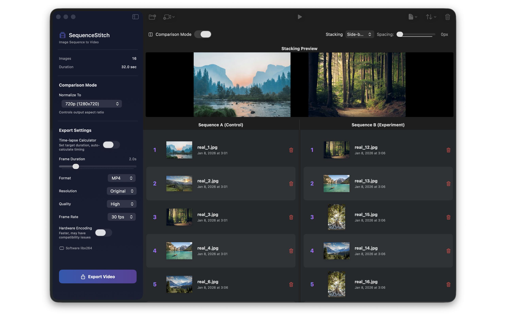

# SequenceStitch

<p align="center">
  
</p>

<p align="center">
  <strong>Convert image sequences to high-quality videos on macOS</strong>
</p>

<p align="center">
  
  
  
</p>

---

## Features

- 🖼️ **Drag & Drop** - Import PNG, JPEG, and PDF files
- 📂 **Folder Import** - Batch import entire folders
- 🔄 **Reorder** - Drag to rearrange sequence order
- ⏱️ **Frame Duration** - Adjustable timing per frame (0.1s - 10s)
- 🎬 **Preview** - Play sequence before exporting
- 💾 **Save Projects** - Save and reload your work
- 🔀 **Comparison Mode** - Side-by-side or top-bottom comparison of two sequences

## Interface

<p align="center">
  
  
</p>

### Export Options

| Setting | Options |
|---------|---------|
| **Format** | MP4, MOV, WebM |
| **Resolution** | Original, 2x, 4x, 720p, 1080p, 4K |
| **Quality** | Low, Medium, High, Lossless |
| **Frame Rate** | 24, 30, 60 fps |
| **Encoding** | Software (libx264) or Hardware (VideoToolbox) |
| **Stacking** | None, Side-by-Side, Top-Bottom (Comparison mode) |

## Two Versions Available

### v1 Lite (~2 MB) - **MIT License Only**
Requires FFmpeg installed via Homebrew. Best for developers and users who already have FFmpeg.

**License**: MIT (simple, permissive)

```bash
# Install FFmpeg first
brew install ffmpeg

# Build v1
./build-v1-lite.sh
```

### v2 Bundled (~52 MB) - **MIT + LGPL**
Includes FFmpeg - no external dependencies. Best for distribution to end users.

**License**: MIT (app code) + LGPL 2.1 (bundled FFmpeg)
⚠️ **LGPL Compliance Required** - See [FFMPEG_LICENSE.md](FFMPEG_LICENSE.md) for details

```bash
# Prepare FFmpeg (one-time setup) - Native Apple Silicon arm64
mkdir -p Resources
curl -L "https://www.osxexperts.net/ffmpeg80arm.zip" -o ffmpeg_arm64.zip
unzip -q ffmpeg_arm64.zip
mv ffmpeg Resources/ffmpeg
chmod +x Resources/ffmpeg
xattr -d com.apple.quarantine Resources/ffmpeg
rm ffmpeg_arm64.zip

# Build v2
./build-v2-bundled.sh
```

## Installation

### Build from Source

```bash
git clone https://github.com/cnrs-oguzumut/SequenceStitch.git
cd SequenceStitch

# Choose your version:
./build-v1-lite.sh      # Requires Homebrew FFmpeg
# OR
./build-v2-bundled.sh   # Self-contained (see setup above)

open build/SequenceStitch.app
```

## Usage

### Single Sequence Mode

1. **Add Images** - Drag files onto the window or use "Open Folder"
2. **Arrange** - Drag rows to reorder, or use Sort menu
3. **Configure** - Set frame duration and export settings
4. **Preview** - Click play to preview the sequence
5. **Export** - Click "Export Video" and choose destination

### Comparison Mode

1. **Enable** - Toggle "Comparison Mode" in the toolbar
2. **Add Sequence A** - Drag images to the left panel (Control/Baseline)
3. **Add Sequence B** - Drag images to the right panel (Experiment/Treatment)
4. **Choose Stacking** - Select "Side-by-Side" or "Top-Bottom"
5. **Export** - Creates a comparison video with both sequences

Perfect for A/B testing, before/after comparisons, or experimental validation!

## Keyboard Shortcuts

| Action | Shortcut |
|--------|----------|
| Preview Play/Pause | `Space` |
| Previous Frame | `←` |
| Next Frame | `→` |

## Tech Stack

- **SwiftUI** - Native macOS interface
- **PDFKit** - PDF rendering to PNG
- **FFmpeg** - Video encoding

## License

### SequenceStitch Application Code
**MIT License** - see [LICENSE](LICENSE) for details.

The SequenceStitch application source code is permissively licensed under MIT, allowing free use, modification, and distribution.

### FFmpeg (Bundled in v2 Only)

⚠️ **The v2 Bundled version includes FFmpeg which is licensed under LGPL 2.1**

This means:
- **v1 Lite**: MIT license only (no LGPL obligations)
- **v2 Bundled**: MIT (app) + LGPL 2.1 (FFmpeg binary)

If you distribute the v2 Bundled version, you **must comply with LGPL 2.1**:
- Provide FFmpeg source code or written offer
- Allow users to replace the FFmpeg binary
- Include license notices

**See [FFMPEG_LICENSE.md](FFMPEG_LICENSE.md) for complete LGPL compliance requirements.**

FFmpeg source code and license information:
- https://ffmpeg.org/
- https://github.com/FFmpeg/FFmpeg
- Native arm64 static builds from [OSXExperts.net](https://www.osxexperts.net/)
- Alternative builds: [evermeet.cx](https://evermeet.cx/ffmpeg/), [Martin-Riedl.de](https://ffmpeg.martin-riedl.de/)

---

<p align="center">
  Made with ❤️ for the creative community
</p>
